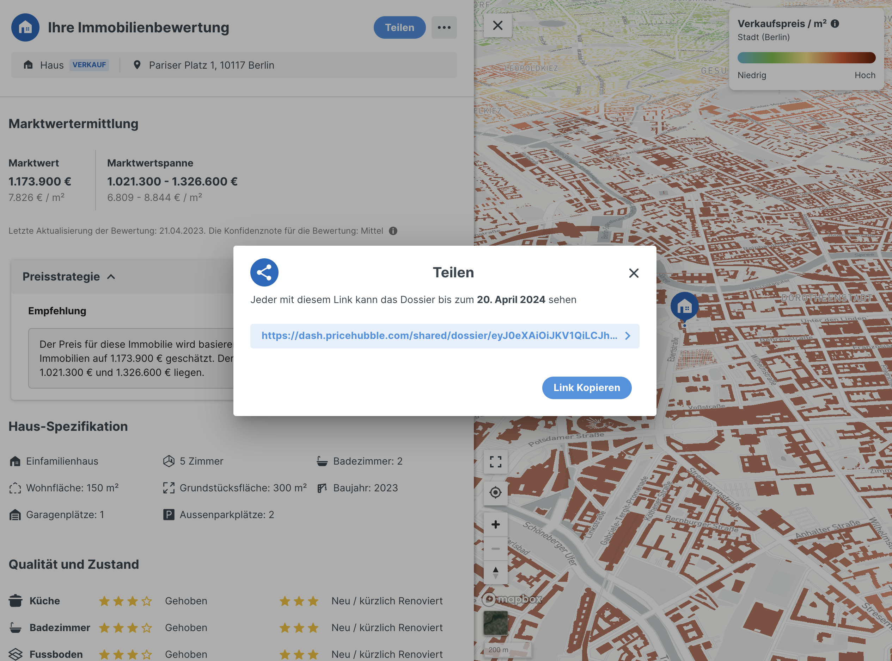
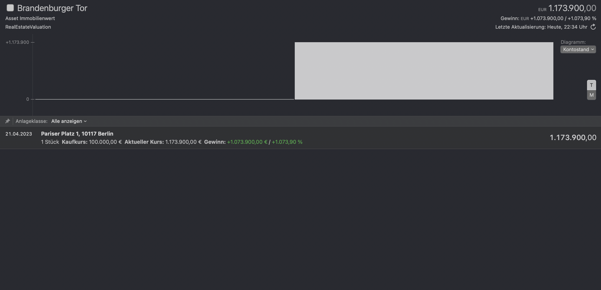

# Real Estate Valuation Extension for MoneyMoney
Fetches the real estate valuation from a dossier created with (https://www.pricehubble.com/de/).

## Howto
- Visit https://www.pricehubble.com/de/, they will advertise customers using their service.
- Now find one which allows to to create a valuation, for example
  * https://baufinanzierung.check24.de/baufinanzierung/immobilienbewertung
- Enter your real estate details and submit. A Dossier will be created.
- Hit the "share" button and copy the URL, that is your username.
  
  
## Account Setup
- Username: Dossier URL (see previous section)
- Password: Initial purchase price (optional)

## Screenshots from MoneyMoney

